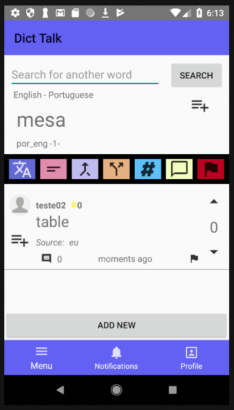

# DictTalk
Open Dictionary (+ Quiz + Social Media)

The ultimate goal of this project is to make an application that people who are learning languages can have an open dictionary to improve their knowledge about the words. Through this application people can learn, teach, leave a comment, discuss about, up vote and down vote everything, see synonyms and antonyms of the words, make list of words and study the words later offline. Other people can access your public lists through your profile and clone them to their lists. There is also a hashtags system, where you can use keywords to classify them by grammar class, etymology, and so on. However just the first stage of the project is complete.

This project can be divided in 3 stages. 
First stage:

- Making a free dictionary, where anyone can add words and translations
- Implementing evaluation system through likes and dislikes
- Saving words in lists
- Implementing User Search

Second stage:

- Implementing sections for example sentences, synonyms, antonyms and comments based on the translation section's system
- Implementing report and help sections
- Implementing Word Quiz
- Implementing List Search

Third stage:

- Implementing Hashtag System
- Implementing Today's Word System
- Implementing availability of offline word quizzes
- Implement Friend System
- Implementing Chat system

## Skills
- Mobile Programming on Android Studio (Java + XML)
- Firebase Database (NoSQL)
